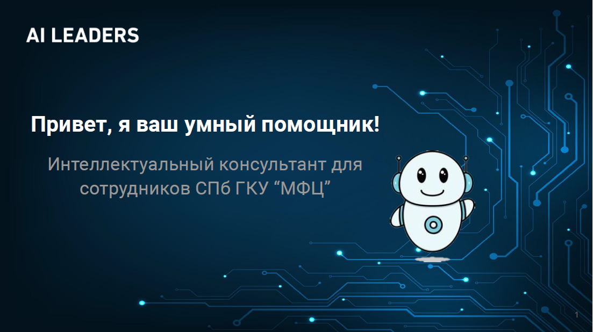

# Описание проекта
Интеллектуальный консультант для сотрудников СПб ГКУ «МФЦ».




[Ссылка на презентацию](https://docs.google.com/presentation/d/1uPfS-alfPM7cwpXv1bicb_FHgRyOWGbiLh49-0PseAo/edit?usp=sharing)

[Ссылка на короткую видеопрезентацию]([http://31.129.97.70:8501](https://youtu.be/ZrTzaFznixo)/)
https://youtu.be/ZrTzaFznixo

## Основные возможности
Умный консультант позволяет:
* Получать ответы на конкретный вопрос
* Получать ссылки на источники данных

## Структура проекта

Проект состоит из 2-х частей:
<details>
  <summary><b><strong>FastAPI</strong></b></summary>
  FastAPI приложение, которое предоставляет доступ к боту и базе знаний. 
</details>

<details>
  <summary><b><strong>База знаний</strong></b></summary>
В базе знаний хранится индекс для поиска ответов на вопросы, связанные с услугами оказываемыми СПб ГКУ «МФЦ».
</details>

## Демонстрация
* Сборка проекта осуществляется с помощью `docker-compose`.
* Создана возможность запускать демо-версию с помощью `Streamlit`.

## Используемые технологии
В проекте используются следующие технологии:
* Python
* Fastapi
* Docker
* Faiss
* Langchain
* OpenAi
* Streamlit

## Запуск проекта
Для запуска проекта необходимо:
1. Склонировать репозиторий
2. Перейти в папку проекта
3. Создать переменную окружения `OPENAI_API_KEY`
4. Создать папку для логов `sudo mkdir -m777 -p logs/fastapi`
5. Запустить проект с помощью команды `docker-compose up --build`
6. Перейти на `localhost:8000` для входа в веб-интерфейс

## Запуск без докера
1. Установить зависимости
```bash
pip install -r fastapi_app/requirements.txt
```
2. Запустить проект
```bash
cd fastapi_app
uvicorn fastapi_app.fastapp:app --reload --port 9000 --env-file config.env
```
где `config.env` - файл с переменными окружения:
```bash
OPENAI_API_KEY={your_key}
DEBUG=True
```

